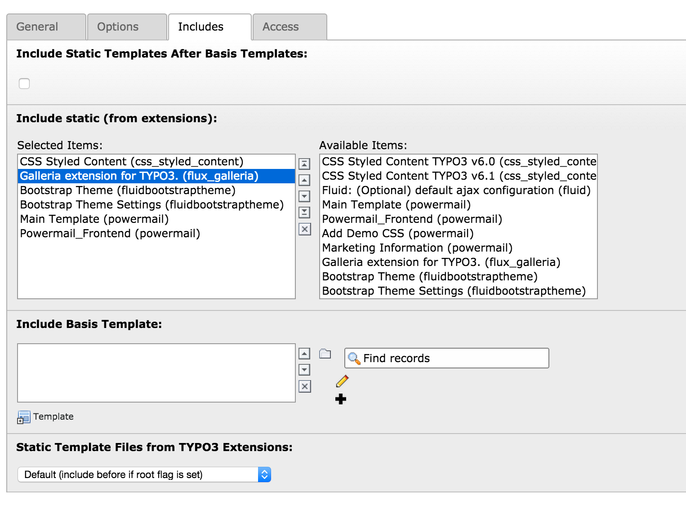
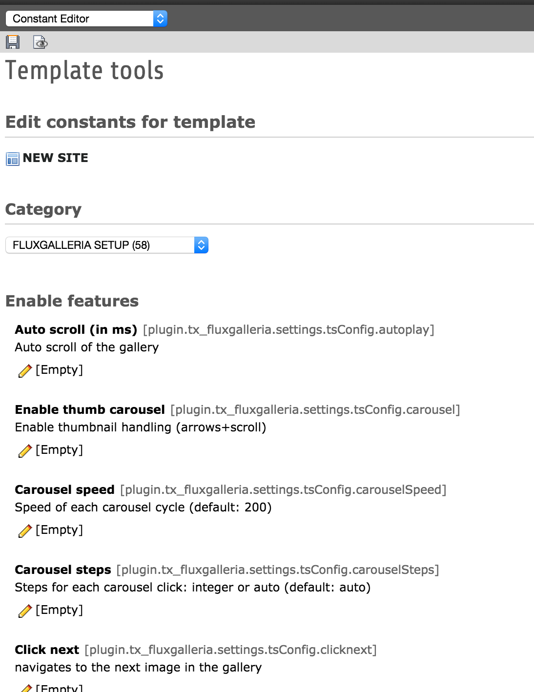

============================
Administrator Manual
============================

Target group: **Administrators**
Here you find all information how to install the gallery extension. Its actually very fast and staight forward

Installation
=============

* Find the extension in the TER and install it
* Make sure that dependency flux ist installed as well
* As last step include static typoscript template 'Galleria extension for TYPO3'

Install the extension as normal in the Extension Manager. Notice, when activating the extension and including the static typoscript
you will find the 'constants' and 'setup' sections.

		Include static template

		Add the static template into your website

Configuration
=======================

* You can change the default behavior of the gallery while changing the typoscript constants or setup
* Additional you can overwrite the configuration through the flexform configuration on each gallery plugin

			Constants configuration of the plugin

			Here you can change the default behaviour of all included galleries
FAQ
====

I guess its pretty much straight forward like any other extension you would install. Please get in touch with me if you bump in any problems.