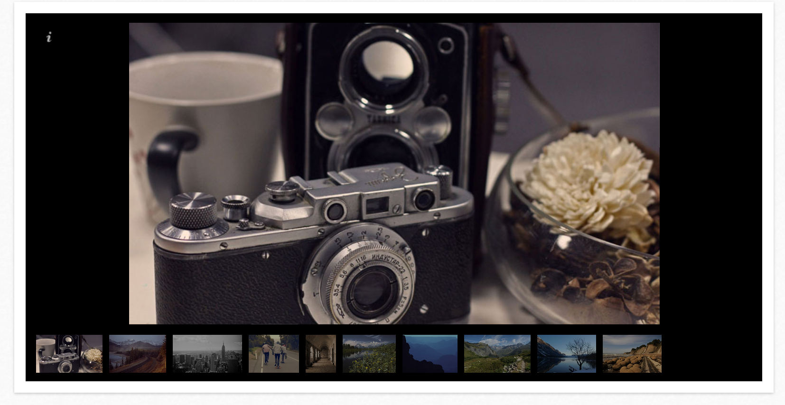

..  Editor configuration
	...................................................
	* utf-8 with BOM as encoding
	* tab indent with 4 characters for code snippet.
	* optional: soft carriage return preferred.

.. Includes roles, substitutions, ...

=================
Extension Name
=================

:Extension name: Galleria extension for TYPO3 CMS.
:Extension key: flux_galleria
:Version: 
:Description: manuals covering TYPO3 extension "Galleria extension for TYPO3 CMS."
:Language: en
:Author: Dominic Garms
:Creation: 2013-05-22
:Generation: 16:22
:Licence: Open Content License available from `www.opencontent.org/opl.shtml <http://www.opencontent.org/opl.shtml>`_

The content of this document is related to TYPO3, a GNU/GPL CMS/Framework available from `www.typo3.org
<http://www.typo3.org/>`_

**Table of Contents**

.. toctree::
	:maxdepth: 2

	ProjectInformation
	UserManual
	AdministratorManual
	TyposcriptReference
	DeveloperCorner

What does it do?
=================

This extension provides an easy and flexible way to include jQuery's `Galleria`_ plugin into your website.

.. _Galleria: http://galleria.io/

	Nice image/video gallery for TYPO3

	Include image, youtube, dailyvideo, vimeo or file collection with few steps into your TYPO3 page