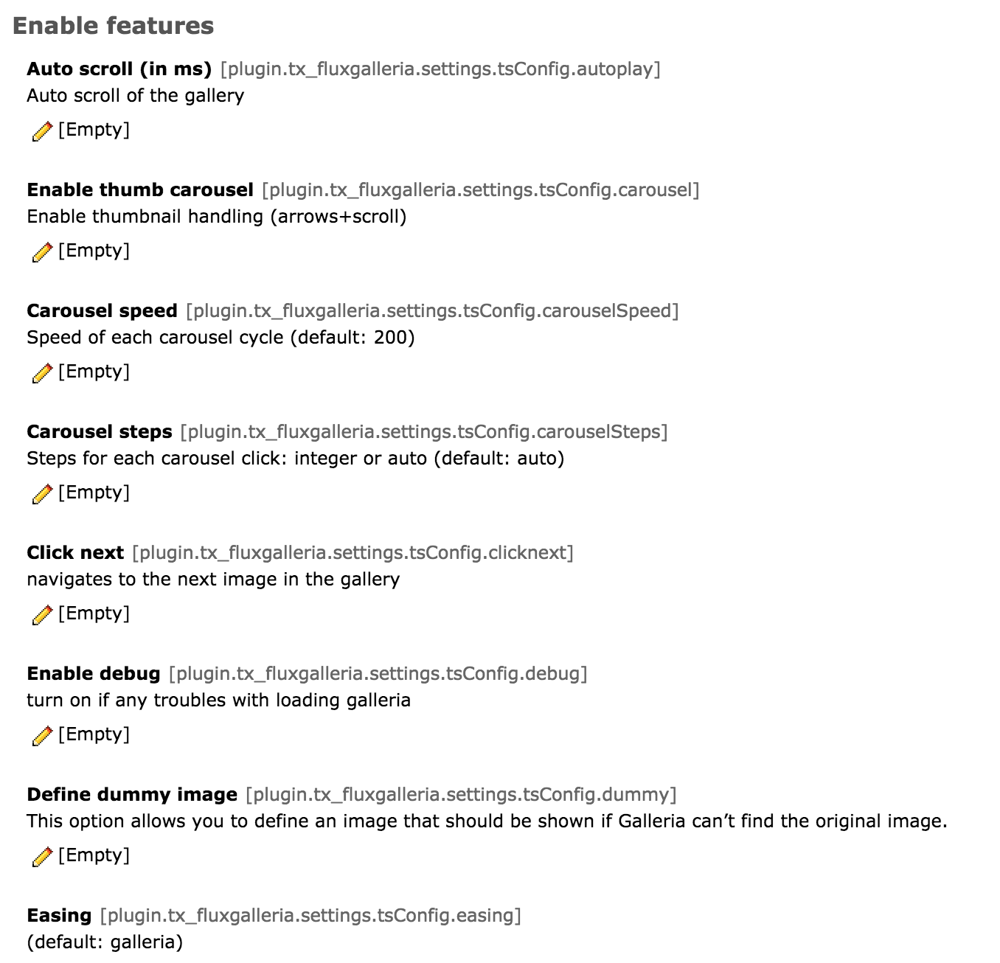
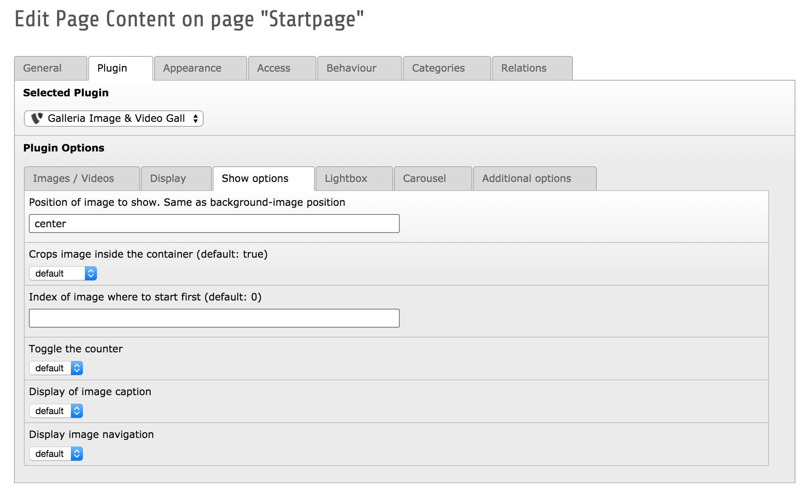

=========================
Configuration Reference
=========================

You configure the extension through constants and flexforms of the included plugin. All constants are taken from the `jQuery Galleria`_ options.

Target group: **Developers**

.. _jQuery Galleria: http://galleria.io/docs/options/#list-of-options

TypoScript Reference
=====================

Please check out the `list of options`_, you will find most of the options as TS constants or flexform values

.. _list of options: http://galleria.io/docs/options/#list-of-options

	Example of some Galleria options

	You can predefine the options of the Galleria through typoscript constants.

	Example of flexform options for each gallery content element

	Overwrite the constants and current behaviour from each gallery content element through flexform values.

FAQ
====

Let me know if you bump into special problems or anything is not clear enough.