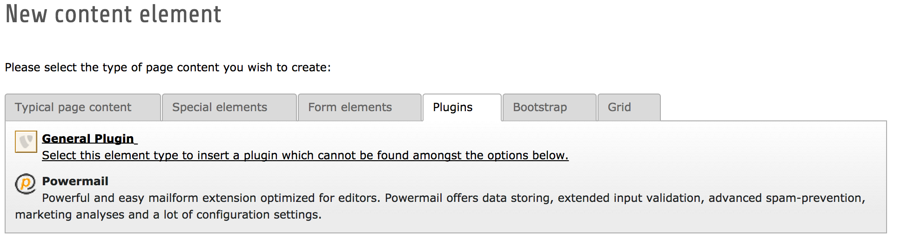
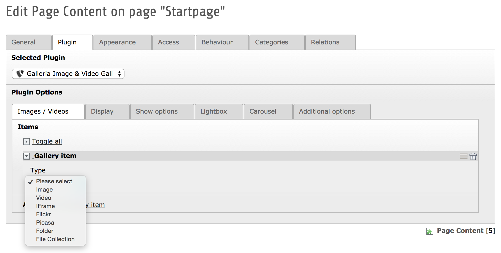

============
Users manual
============

Target group: **Editors**

You can add a gallery plugin on each section of your project.

* Add new content element 'General Plugin' inside of the 'Plugins' tab
* Choose 'Galleria Image & Video Gallery' from the plugin selector
* Start adding gallery content
* Adjust the behavior through flexform or typoscript configuration

Here you find some screenshots for the first steps:

		Add new content element

		Select the 'General Plugin' from the content element selection

:width: 500px
		:alt: Select Galleria

		Select Galleria form the selector

		Select the Galleria plugin and start adding image items and adjust the behaviour through the flexform values

FAQ
====

Nothing yet...
